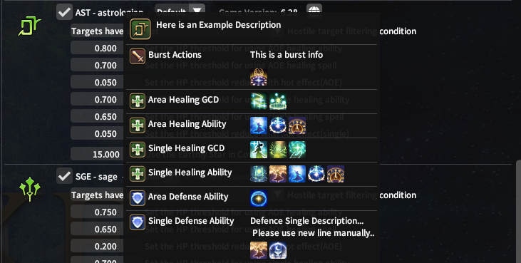

# Customization

Want to write a better rotation? You need to customize it!


## Configuration

Do you want to have your own configuration to control the rotation? Then, you need to override the `CreateConfiguration` method.

Here is an example in BRD:

``` c#
    private protected override IRotationConfigSet CreateConfiguration() => base.CreateConfiguration()
            .SetBool("BindWAND", false, "Use Raging Strikes on WAND")
            .SetCombo("FirstSong", 0, "First Song", "WAND", "MAGE", "ARMY")
            .SetFloat("WANDTime", 43, "WAND Time", min: 0, max: 45, speed: 1)
            .SetFloat("MAGETime", 34, "MAGE Time", min: 0, max: 45, speed: 1)
            .SetFloat("ARMYTime", 43, "ARMY Time", min: 0, max: 45, speed: 1);
```

Just use the methods whose name started with `Set`. They are `SetFloat`, `SetString`, `SetBool`, `SetCombo`.

If you want to get the value of configuration, You can do like this by using the methods whose name started with `Get`.

```c#
var time = Configs.GetFloat("WANDTime");
```


## Custom Field

Sometimes, for saving the resource. We want to save the value to the field. But when to update these value? In  method `UpdateInfo`.

``` c#
    private protected override void UpdateInfo() 
    {
        //Set your value to field here.
        base.UpdateInfo();
    }
```


## Description

More description about your rotation? Override the `Description`.

Here is an example AST:

``` c#
    public override string Description => "Here is an Example Description.";
```

And for the macro special duration. You can use attribute called `RotationDesc` to describe it. 

Burst Info should be attached on the class.

``` c#
[RotationDesc("This is a burst info", ActionID.Divination)]
internal sealed class AST_Default : AST_Base
{
    //...
}
```

You can also separate it to describe, or just write one.

``` c#
[RotationDesc("Defence Single Description...\n Please use new line manually..")]
[RotationDesc(ActionID.CelestialIntersection, ActionID.Exaltation)]
private protected override bool DefenceSingleAbility(byte abilitiesRemaining, out IAction act)
{
    //...
}
```

This is what tooltips look like.



## RotationCheck

It is a special delegate to make your rotation clear.

Sometimes, some action has a special usage logic, and throughout. You can add it to the RotationCheck in BaseAction.

Here is an example in SCH:

``` c#
    public SCH_Default()
    {
        SummonSeraph.RotationCheck = b => WhisperingDawn.ElapsedAfterGCD(1) || FeyIllumination.ElapsedAfterGCD(1) || FeyBlessing.ElapsedAfterGCD(1);
    }
```


## Heal & Defense

If you don't want to use the auto heal or defense by default, you can override them! They are `CanHealAreaAbility`, `CanHealAreaSpell`, `CanHealSingleAbility` and `CanHealSingleSpell`.

Here is a simplified example in SCH:

```c#
    protected override bool CanHealSingleSpell => base.CanHealSingleSpell && Configs.GetBool("GCDHeal");
    protected override bool CanHealAreaSpell => base.CanHealAreaSpell && Configs.GetBool("GCDHeal");

    private protected override IRotationConfigSet CreateConfiguration()
    {
        return base.CreateConfiguration().SetBool("GCDHeal", false, "Aut use GCD to heal");
    }
```


## Localization

If you want your UI and description to support multiple languages, Add your custom Properties to the file located in `Localization\Strings_Rotation`. And use it like `LocalizationManager.RightLang.%PropertyName%`.


## Tincture

You can use tincture when you call `UseTincture` method in rotation. It will only be used in full party at level 90.